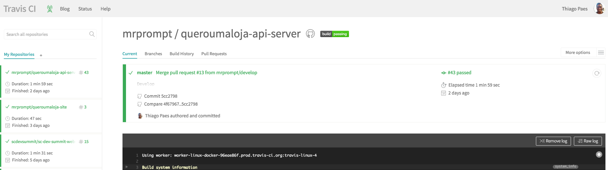

#  Cadastro

O cadastro é simples e rápido, bastando você se logar com sua conta do **GitHub** e logo você cai na Dashboard,
onde estão seus projetos listados em uma coluna à esquerda e o status detalhado do build do projeto selecionado.

Caso seja seu primeiro acesso, você não terá nenhum projeto listado, tendo que habilitar na tela de configurações que
veremos a seguir com detalhes.
