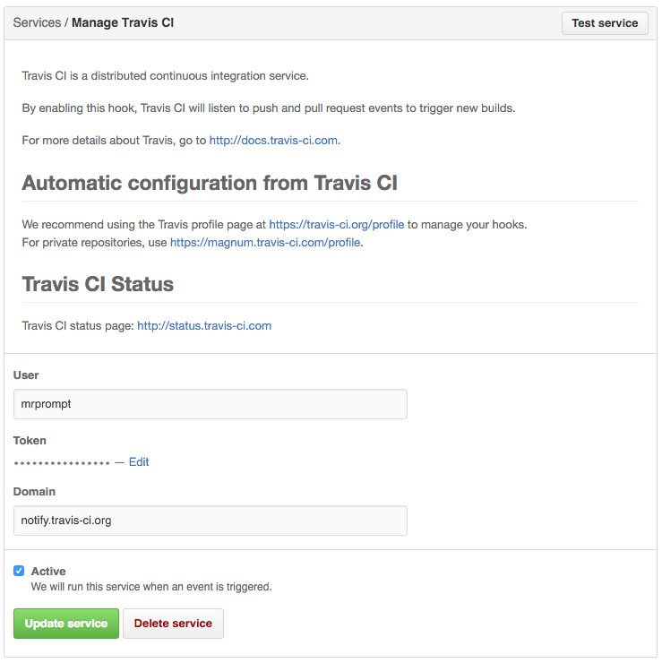

# <a name="configurando"></a> Configurando

Tão simples quanto o cadastro é a configuração do **Travis-CI** para cada projeto.


Nela você pode configurar dentre as variáveis de ambiente - caso seu projeto utilize - se o build ocorrerá somente nos
"pushs" do projeto ou também sobre cada pull request - ótimo e aconselhável.

O arquivo _.travis.yml_ é onde ficam as configurações necessárias para rodar os testes e etc, abaixo, o arquivo de
configuração de um projeto simples em _PHP_:

```
language: php

php:
  - 7.0

before_script:
  - composer install --dev --prefer-dist

script:
  - ./vendor/bin/phpunit
```

Não se assuste com nada, é só um exemplo. Mas você já pode ver que com poucas linhas, você já tem seu projeto sendo
testado automaticamente a cada Push ou <abbr title="Pull Request">PR</abbr>.

No arquivo você também pode configurar ações para cad etapa do build, são elas:

1. before_install
2. install
3. before_script
4. script
5. after_success or after_failure
6. before_deploy *
7. deploy *
8. after_deploy *
9. after_script

As ações marcadas com "*" são opcionais no arquivo de configuração. Na verdade, você também não é obrigado a configurar todos
os passos citados ;)


Também é possível clicar no canto superior direito, acessando o menu _Accounts_ para integrar - ou desligar - outros projetos
que você tenha acesso.

Sua conta e organizações que você esteja vinculado, ficarão listados na coluna a esquerda, bastando clicar sobre, para obter uma
listagem de projetos do qual você possu permissão de acesso.

A direita, temos a listagem de projetos, e também o botão de sincronização. O **Travis-CI** sincroniza sua conta de tempos em tempos,
porém, as vezes é necessário dar uma clicada ali para obter uma listagem mais recente, principalmente se você acabou de criar
o projeto no **GitHub**.

Na listagem, é possível habilitar e desabilitar a integração com o **Travis-CI**, assim como ir direto às configurações do projeto,
como falado anteriormente.

Na imagem abaixo, temos um exemplo de projetos integrados e não integrados com a ferramenta, assim como algumas organizações que
possuo acesso através do [meu **GitHub**](https://github.com/mrprompt).


Com o **Travis** habilitado para seu projeto, você pode ir até a página do projeto no **GitHub** e olhar as configurações do
serviço, na aba _Webhooks & Services_, nela, você verá uma imagem semelhante a abaixo, onde você poderá ver serviço habilitado.


Clicando no lápis, teremos detalhes da configuração - não se preoupce, você não precisa mexer em nada aqui:



Você também pode testar o serviço, sem ter que fazer um push para seu repositório, clicando no botão "Test service" logo no topo.
