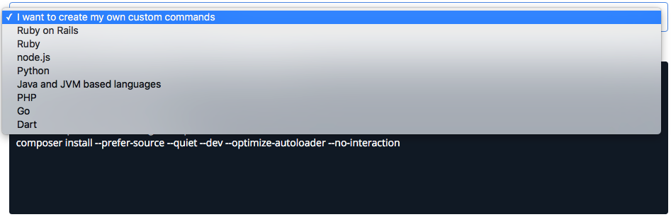
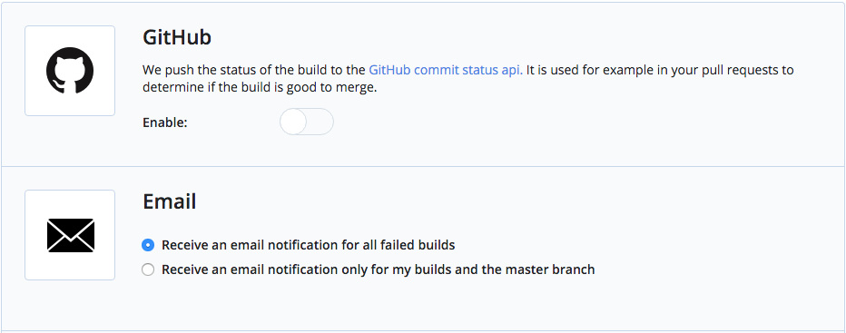
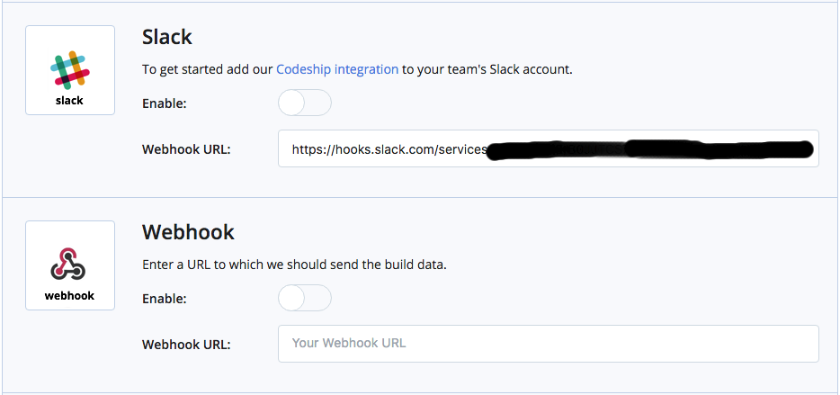

###  Configurando

A configuração do **CodeShip** é toda por sua interface, que aliás, é muito simples e resumida, sem muitas surpresas.
O primeiro passo, é selecionar o ambiente a ser utilizado, basicamente, você seleciona a plataforma e ele te da algum exemplo de código, como abaixo.

Após a escolha, é possível editar e dar uma melhorada no ambiente. Nas contas pagas, é possível definir diversos "pipelines", ou seja, rodar diversas métricas em
paralelo, para melhorar a performance. Testei em um projeto e não tive um ganho muito significativo pra compensar o uso pra falar a verdade, mas creio que isso
seja um problema na minha arquitetura.

<small>É possível utilizar algumas variáveis de ambiente pré-definidas</small>

Existem ainda as diversas integrações para configurar o deploy automatizado, como **AWS**, **Digital Ocean** e etc., assim como também é possível você
rodar seu próprio script, ou mesmo o **Curl** para enviar uma chamada a outro serviço, como é o meu caso com o **DeployBot** - esse eu prentendo falar em um outro
artigo futuro.

Finalizando a configuração do **Deploy**, você também pode configurar notificações:

    

        
    

    

        
    

Assim como o **Travis-CI** e outros serviços, também é possível configurar as próprias variáveis de ambiente, para serem utilizadas durante o processo:

E se tudo der certo - ou mesmo se der tudo errado -, você pode conferir os detalhes do build:

