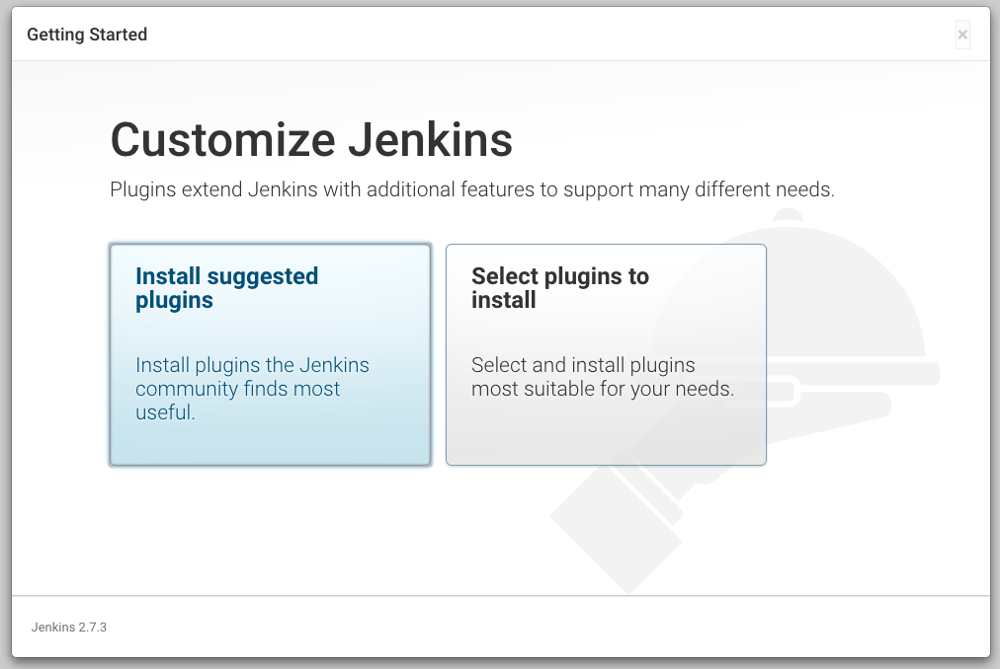
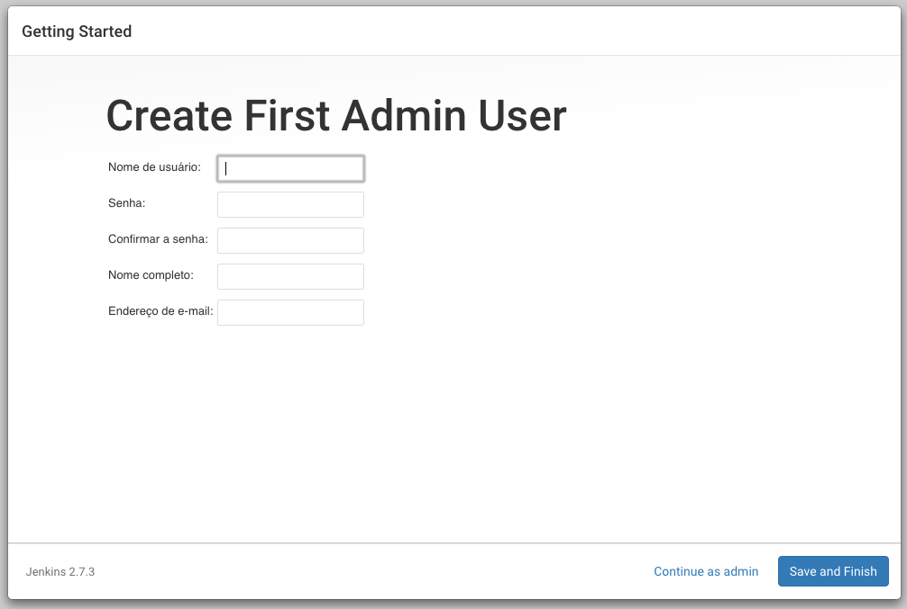
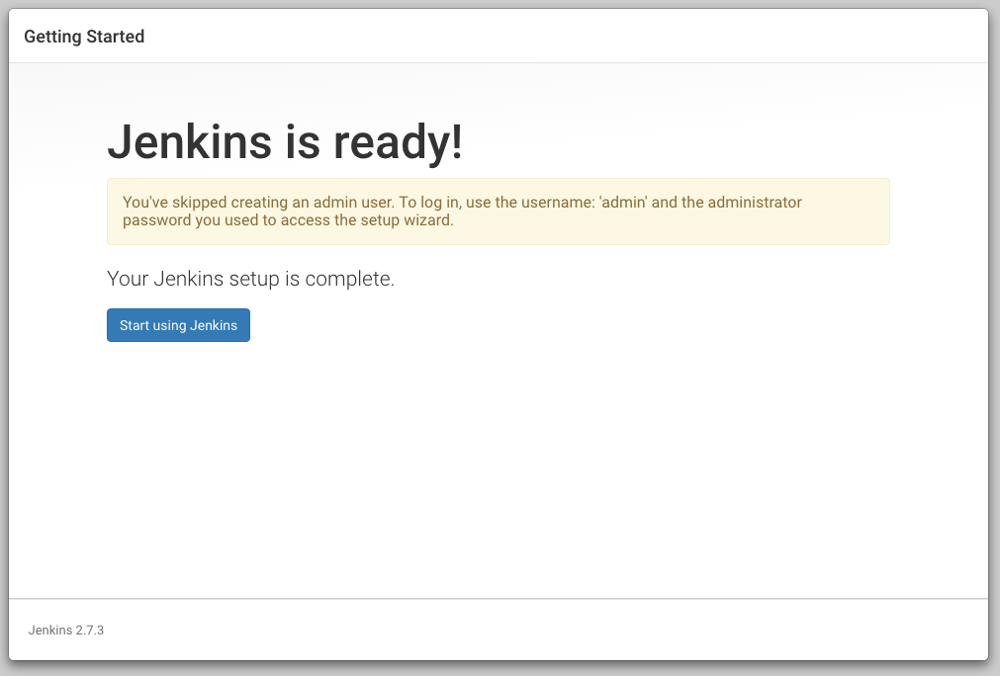
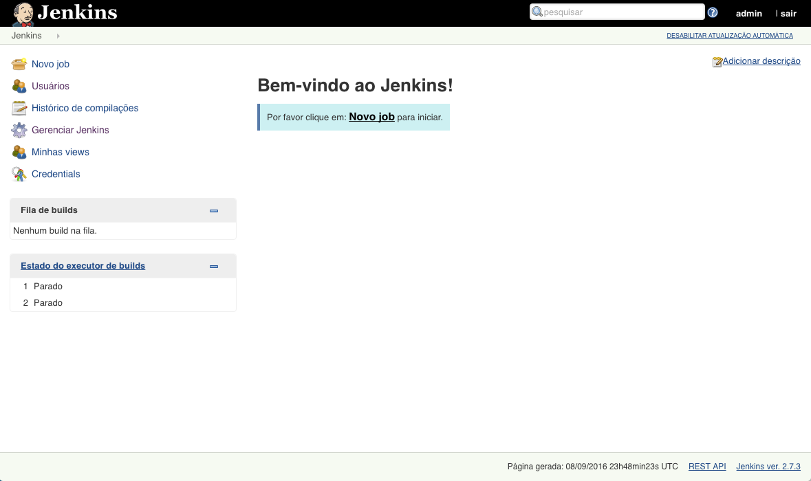

### <a name="instalacao"></a> Instalação

O Jenkins pode ser instalado de várias formas, o jeito mais simples, é utilizando o nosso tão conhecido apt-get ou yum, mas também pode ser instalado via homebrew para os usuários de Mac, ou simplesmente rodando o jar baixado no site. Eu prefiro sempre a primeira opção, buscando um repositório constantemente atualizado e etc.

Outra opção rápida que temos, apenas para fins de testes, é a VM disponibilizada pela [Openshift](https://www.openshift.com), a instalação é automática em poucos cliques, e você recebe o seguinte ambiente configurado por padrão:

- PHP 5.3.3
- Java 1.7.0_111
- Nodejs 0.6.20
- Ruby 1.8.7

Tudo bem desatualizado eu sei, mas como eu disse, para fins didáticos está ótimo.

Agora, se você preferir uma instalação local, eu recomendo que o faça em uma máquina Linux utilizando um repositório atualizado, ou baixando
o *war* direto do site.

Mas para este artigo, preferi utilizar o [Docker](https://docker.com) e instalar o Jenkins disponibilizado no [DockerHub](https://hub.docker.com/_/jenkins/):

```
docker pull jenkins
```

E mandei bala para rodar, é importante dar atenção a saída do log na tela, para pegarmos a chave de autenticação inicial, para podermos
prosseguir com a instalação:

```
docker run -p 8080:8080 -p 50000:50000 jenkins
```

Feito isso, abrimos o endereço **http//localhost:8080** e temos o primeiro passo da instalação, onde inserimos a chave gerada quando subimos o serviço:


Desbloqueada a tela, você tem duas duas opções para prosseguir, por hora vamos na primeira porque é mais prático:

|  | |

Após tudo instalado - espero que você tenha lembrado de pegar um café enquanto o download dos plugins acontecia -, caímos na tela de criação de usuário, mas você também pode clicar em continuar como admin caso não vá compartilhar o ambiente com mais ninguém.

|  |  |

Tudo instalado e rodando bonitinho, temos o Jenkins funcionando e exibindo a tela inicial vazia, pois ainda não criamos nenhum trabalho.


