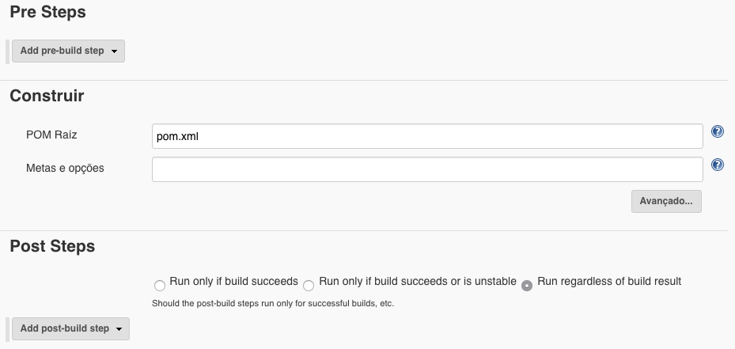

####  Java

Para nosso exemplo em java, utilizei a criação do trabalho do tipo Maven.

Em seguida, adicionei o repositório e deixei nas configurações default, para que ele leia o arquivo POM do projeto e tente executar o build.

