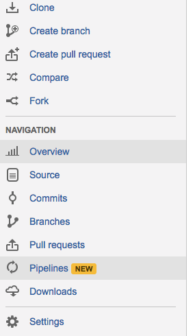
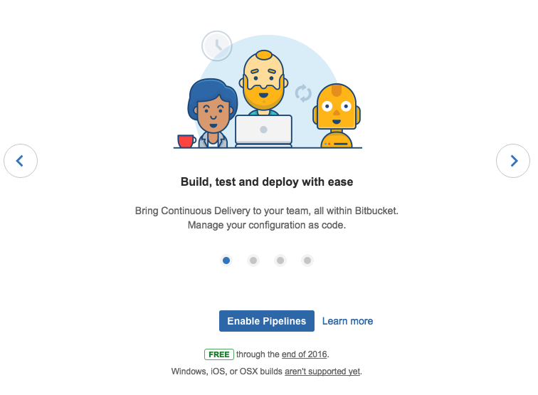
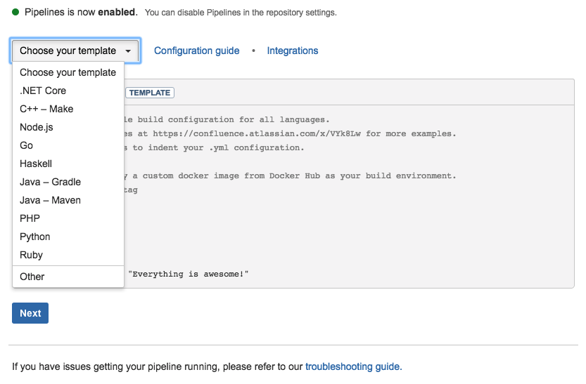

# Integração Contínua com Bitbucket Pipelines


Parando de enrolação, vamos ao que interessa, [Pipelines](https://confluence.atlassian.com/bitbucket/bitbucket-pipelines-792496469.html)!

- [Apresentação](bibucket-pipelines.1.md)
- [Instalação](bibucket-pipelines.2.md)
- [Configurando](bibucket-pipelines.3.md)
    - [PHP](bibucket-pipelines.4.md)
    - [Nodejs](bibucket-pipelines.5.md)
    - [Angularjs](bibucket-pipelines.6.md)
    - [Ruby](bibucket-pipelines.7.md)
    - [Java](bibucket-pipelines.8.md)
- [Trabalhando com múltiplos branchs](bibucket-pipelines.9.md)
- [Containers auxiliares](bibucket-pipelines.10.md)
- [Cache](bibucket-pipelines.11.md)
- [Prós & Contras](bibucket-pipelines.12.md)
- [Conclusão](bibucket-pipelines.13.md)
- [Mais Informações](bibucket-pipelines.14.md)

### <a name="apresentacao"></a> Apresentação

O [Pipelines](https://confluence.atlassian.com/bitbucket/bitbucket-pipelines-792496469.html) era sem dúvida a ferramenta que faltava para quem trabalha com repositórios no [Bitbucket](https://www.bitbucket.org). Simples de configurar, utiliza [Docker](https://www.docker.io) e grátis, inclusive para repositórios privados.

### <a name="instalacao"></a> Instalação

A instalação do Pipelines é bem simples, bastando que você habilite no menu lateral e siga os passos na tela. A instalação inicial, se divide em dois passos bem simples



#### Passo 1
Clicando no menu lateral, tem um pequeno slideshow apresentando o Pipelines e solicitando que você concorde com a instalação, já que ele vai criar um novo arquivo no seu projeto - não se preocupe com isso agora.



#### Passo 2
O segundo passo da instalação, é selecionar o ambiente que você pretende configurar, existem várias opções, cada uma irá apresentar um esqueleto bem simples de configuração para cada tipo de projeto, não se preocupe com o que aparecer na tela, futuramente você poderá editar este arquivo.




### <a name="configurando"></a> Configurando

Finalizando os passos, será criado no projeto o arquivo **bitbucket-pipelines.yml**, contendo a configuração do ambiente e dos passos necessários para alcançar o sucesso do nosso build.

Aqui vem a parte chata da configuração, toda modificação que você fizer neste arquivo, é um commit + push que você precisa mandar pro projeto - você também pode rodar os builds localmente, mas [dá trabalho](https://confluence.atlassian.com/bitbucket/debug-your-pipelines-locally-with-docker-838273569.html).  Pessoalmente, acho um pouco chato isso e suja o projeto, mas vamos lá.

O ambiente de integração, utiliza containers do Docker para rodar, então, o nosso primeiro passo na configuração do projeto, e informar a imagem que precisamos utilizar para nosso build. Esta imagem pode ser tanto um container disponível no [Docker Hub](hub.docker.com) quanto um container próprio.

Caso você não especifique uma imagem, será utilizada uma [imagem padrão](https://hub.docker.com/r/atlassian/default-image/), baseada no [Ubuntu 14.04](http://releases.ubuntu.com/14.04/), disponibilizada pelo time da [Atlassian](https://br.atlassian.com/), que contém algumas ferramentas por padrão:

- wget
- xvfb
- curl
- git: 1.9.1
- java: 1.8u66
- maven: 3.0.5
- node: 4.2.1
- npm: 2.14.7
- nvm: 0.29.0
- python: 2.7.6
- gcc: 4.8.4

A configuração do Pipelines é baseado em blocos de passos, chamado no arquivo de configuração de **step**.

Cada **step** possui um **script**, que são os comandos rodados para a conclusão do build. Cada linha, do script, é um comando rodado após o término do anterior.

O bloco **default** irá rodar os passos configurados nele para todos os branchs que receberem uma atualização, como um push ou um merge.

Você também pode criar blocos de configurações para determinados branchs ou tags, e rodar os passos achar necessário. Eu gosto muito desse tipo de configuração, para disparar o evento de deploy, que sempre deixo a cargo de outra ferramenta.

Um exemplo do arquivo de configuração é esse:

```
# This is a sample build configuration for PHP.
# Check our guides at https://confluence.atlassian.com/x/VYk8Lw for more examples.
# Only use spaces to indent your .yml configuration.
# -----
# You can specify a custom docker image from Docker Hub as your build environment.
image: phpunit/phpunit:5.0.3

pipelines:
  default:
    - step:
        script: # Modify the commands below to build your repository.
          - composer install
```

Você pode ter uma referência completa do arquivo de configurações [aqui](https://confluence.atlassian.com/bitbucket/configure-bitbucket-pipelines-yml-792298910.html).

#### Bônus Track - Exemplos de Configuração

Como sempre, vou mostra abaixo algumas configurações utilizadas nos projetos que tenho no Pipelines, e também algumas disponíveis no próprio [guia](https://confluence.atlassian.com/bitbucket/language-guides-for-bitbucket-pipelines-856821477.html) do Pipelines.

#### <a name="configurando-php"></a> PHP

```
image: phpunit/phpunit:5.0.3

pipelines:
  default:
    - step:
        script:
          - composer --version
          - phpunit --version
          - composer install
          - phpunit --configuration tests/phpunit.xml
```

#### <a name="configurando-nodejs"></a> Nodejs

```
image: node:6.0.0

pipelines:
  default:
    - step:
        script:
          - npm install --silent --progress=false
          - npm test
```
Meu bloco **scripts** do package.json:

```
...
"scripts": {
  "start": "node app.js",
  "test": "mocha test/**/*Test.js",
  "coverage": "istanbul cover _mocha -- -R spec"
},
...
```

#### <a name="configurando-angularjs"></a> Angularjs

```
image: node:6.0.0

pipelines:
  default:
    - step:
        script:
          - npm install --silent --progress=false
          - npm run bower
          - npm run build
          - nohup bash -c "npm run webdriver-start 2>&1 &" && sleep 9
          - npm run start 2>&1  &
          - npm test
```

Meu bloco **scripts** do package.json:

```
...
"scripts": {
  "bower": "bower install",
  "build": "gulp build",
  "start": "gulp serve",
  "webdriver-start": "webdriver-manager update && webdriver-manager start",
  "test": "protractor protractor.conf.js"
},
...
```

#### <a name="configurando-ruby"></a> Ruby

```
image: ruby:2.3.0

pipelines:
  default:
    - step:
        script:  # Modify the commands below to build and test your repository.
          - ruby --version
          - bundler --version
          - bundle install
```

#### <a name="configurando-java"></a> Java

```
# You can use any Docker image from Docker Hub or your own container registry
image: maven:3.3.3

pipelines:
  default:
    - step:
        script:  # Modify the commands below to build and test your repository.
          - mvn --version
          - mvn clean install
```

#### <a name="configurando-multiplos-branchs"></a> Trabalhando com múltiplos branchs

```
image: node:6.0.0

pipelines:
  default:
    - step:
        script:
          - npm install
          - npm test

  branches:
    develop:
      - step:
          script:
            - npm install
            - npm test
            - npm run deploy:develop

    homolog:
      - step:
          script:
            - npm install
            - npm test
            - npm run deploy:homolog

    master:
      - step:
          script:
            - npm install
            - npm test
            - npm run deploy:production
```

### <a name="pros-e-contras"></a> Prós & Contras

A favor do Pipelines, tem muita coisa, apesar de ser uma ferramenta nova e ainda em sua versão beta, ela cumpre o que promete e reconhece [suas limitações](https://confluence.atlassian.com/bitbucket/limitations-of-bitbucket-pipelines-827106051.html).

Os builds rodam muito rápido e fazer parte do Bitbucket, e não como uma ferramenta a parte, conta muitos pontos.

Rodar sobre o docker também é muito bom, porque permite um controle maior de todo o ambiente, sem a necessidade de ficar dando manutenção em servidores.

Como não podia faltar em nenhuma ferramenta de CI, existem [várias integrações](https://confluence.atlassian.com/bitbucket/bitbucket-pipelines-integrations-826868162.html) prontas para utilizar, como Deploy para S3, Heroku, Azure e etc.

Contra, por enquanto, é que o Pipelines ainda é um pouco problemático com o arquivo de configuração - talvez isso seja problema do próprio yaml - mas as vezes incomoda e fica difícil de debugar sem sujar o repositório com vários commits. Talvez um validador online facilitasse as coisas.


### <a name="conclusao"></a> Conclusão

Para quem utiliza exclusivamente o Bitbucket como controle de versão e possui projetos privados, mas não quer gastar uma quantia considerável para rodar utilizar uma ferramenta de CI, o Pipelines cai como uma luva.

Com uma configuração bem simplificada, sem a necessidade de instalar dezenas de ferramentas anteriormente e etc, é a ferramentas ideal para equipes e projetos de qualquer tamanho, possibilitando um fluxo de entrega muito mais ágil e de configuração visível para todos os membros da equipe. Possibilitando inclusive simulações locais do ambiente de build.

Rodando sobre Docker, é possível manter ainda mais controle sobre o ambiente necessário para o ideal funcionamento do projeto, dando ainda mais transparência sobre o processo.

### <a name="mais-informacoes"></a> Mais Informações

- [Bitbucket Pipelines](https://confluence.atlassian.com/bitbucket/bitbucket-pipelines-792496469.html)
- [Get started with Bitbucket Pipelines](https://confluence.atlassian.com/bitbucket/get-started-with-bitbucket-pipelines-792298921.html)
- [Language guides](https://confluence.atlassian.com/bitbucket/language-guides-for-bitbucket-pipelines-856821477.html)
- [BITBUCKET-PIPELINES.YML REFERENCE](https://confluence.atlassian.com/bitbucket/configure-bitbucket-pipelines-yml-792298910.html)
- [Language guides for Bitbucket Pipelines](https://confluence.atlassian.com/bitbucket/language-guides-for-bitbucket-pipelines-856821477.html)

E é isso, obrigado pela leitura, espero que tenha curtido o post e nos vemos nos próximo da série ;)


## Cache

Não tenho tido muito tempo de continuar a série sobre integração contínua, porém, venho utilizado
no meu dia a dia o Bitbucket Pipelines como principal ferramenta de CI. Com isso, tenho podido
acompanhar a evolução desta ferramenta e a facilidade de uso que o time do Bitbucket vem 
proporcionando a cada atualização.

Um dos maiores problemas na integração contínua, é a instalação de todas as dependências do 
projeto até chegar na produção de artefatos limpos. Rodar um ``composer install`` ou um ``npm install`` 
a cada build pode ser custoso e demorado. Nenhum time quer esperar vários minutos para saber se 
um push é válido ou não, isso atrasa e muito as entregas.

Uma atualização bacanuda é a possibilidade de utilizarmos cache para as dependências dos nossos projetos.

A instação é bem simples, vou colocar um exemplo prático, para cachearmos as dependências administradas 
pelo composer em uma aplicação PHP:

```yml
image: php:7.1.6-cli

pipelines:
  default:
    - step:
        caches:
          - composer
        script:
          - curl -sS https://getcomposer.org/installer | php -- --install-dir=/usr/local/bin --filename=composer
          - composer install
          - ./vendor/bin/phpunit -c phpunit.xml.dist
```

Bem simples não? Como você pode ver, apenas adicionamos o tipo de cache que queremos utilizar, o Pipelines nos dá
várias opções pré-configuradas para diversas linguagens, mas também podemos utilizar o nosso próprio, como mostrarei
abaixo, para aplicações em angular:

```yml
image: node

pipelines:
  default:
    - step:
        caches:
          - node
          - bower
        script:
          - npm install --progress=false
          - ./node_modules/.bin/bower install --allow-root
          - npm test

definitions:
  caches:
    bower: bower_components
```

Como você pode ver, utilizei uma configuração pré-existente (node) e uma customizada (bower) para cache.

Para saber mais, veja a [documentação oficial](https://goo.gl/AwCzxH).


## Containers auxiliares

Deu de notar que to completamente viciado no Bitbucket Pipelines? Pois é, como disse, tenho utilizado ele todos os dias
na [BeeTech](https://www.beetech.global), então, nada mais natural do que ir acompanhando - e aplicando - as novidades 
que vão aparecendo.

Um pouco antes do [Cache](/2017/07/21/integracao-continua-pipelines-cache/), foi implementado o recurso de containers paralelos,
ou auxiliares, como queira chamar, que nada são que container que rodam junto com seu fluxo de CI. Como um banco de
dados por exemplo.

Você não precisa instalar o PostgreSQL no seu container ou outros serviços "pesados" que precisem estar a postos antes
de rodar seus testes, você pode facilmente chamar um container auxiliar eu seu fluxo e pronto, o Pipelines vai subir 
esta instância, e deixa-la disponível para seus testes.

A sintaxe é bem simples, vou mostrara abaixo, como subir um container contendo o PostgreSQL:

```
image: node

pipelines:
  default:
    - step:
        caches:
          - node
        script:
          - npm install --progress=false
          - npm test
        services:
          - database

definitions:
  services:
    database:
      image: sameersbn/postgresql:9.6-2
      environment:
        DB_USER: 'foooooo'
        DB_PASS: 'baaaaar'
        DB_NAME: 'foobaar
```

Como disse, a sintaxe é simples, basta você setar um alias para o serviço, em nosso caso "database", e nas suas "definitions" 
configurar o serviço, que pode ser qualquer imagem Docker, seguido dos parâmetros que você utilizaria para rodar o container
normalmente.

Simples não? Com isso, com certeza seu fluxo de CI ficará bem mais rápido e cada vez menos engessado - ou no mínimo, seu container 
diminuirá drasticamente de tamanho.

Até a próxima!
